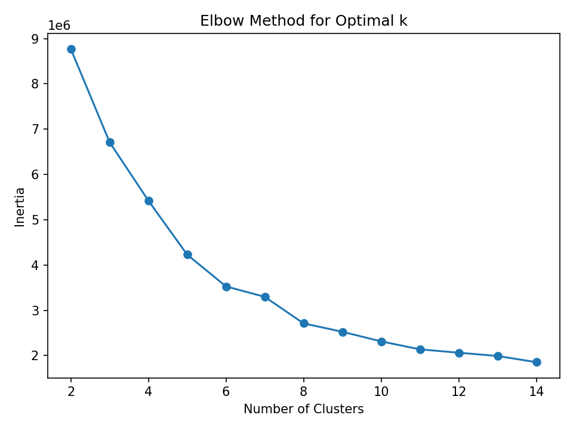
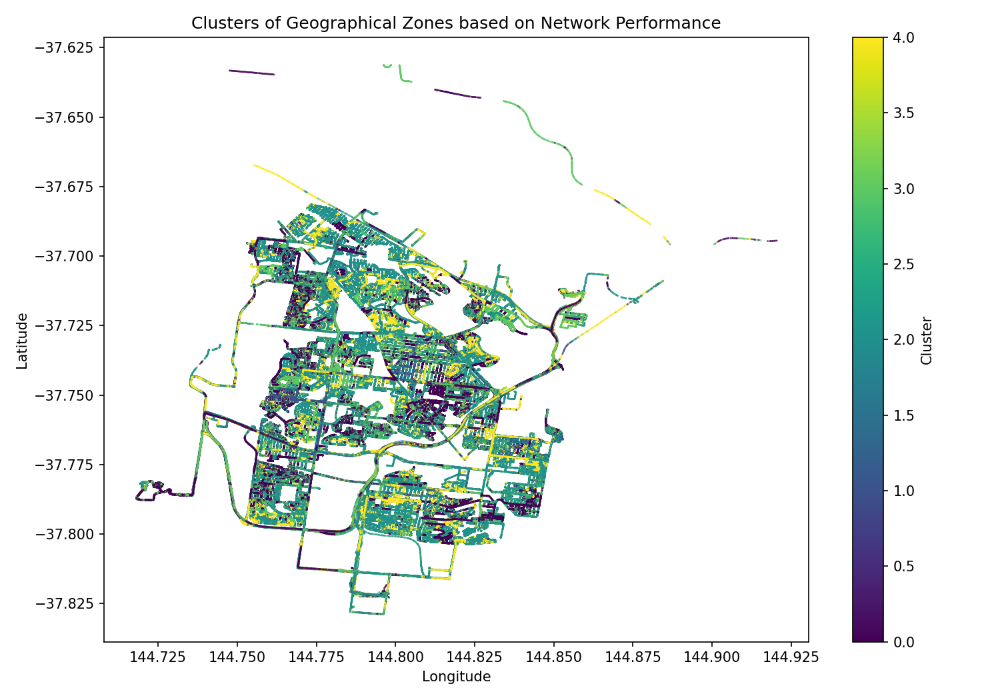
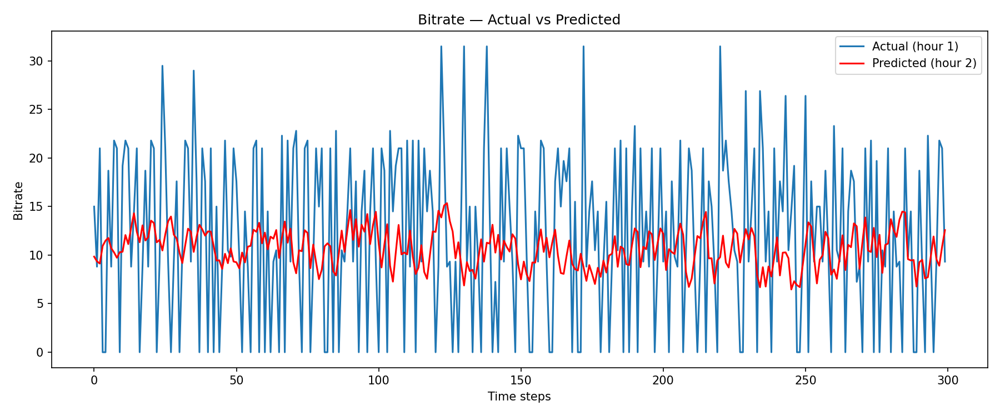

# 5G Network Performance Analysis & Forecasting


A machine learning pipeline that analyses real-world **5G network performance data** collected from mobile testing trucks across **Melbourne, Australia**. The project combines **unsupervised clustering** to identify geographical network zones and **LSTM-based time-series forecasting** to predict future network conditions.

---

## 📋 Table of Contents
- [Overview](#overview)
- [Results](#results)
- [Dataset](#dataset)
- [Project Structure](#project-structure)
- [Models](#models)
- [Getting Started](#getting-started)
- [Usage](#usage)

---

## Overview

This project addresses two core problems in 5G network analysis:

1. **Where do performance differences occur?** — KMeans clustering segments geographic zones by network behaviour, helping identify coverage gaps and high-demand areas.
2. **What will performance look like next hour?** — An LSTM neural network trained on a 3600-second sliding window forecasts future bitrate, enabling proactive network management.

Target audience: network engineers, telecom providers, and city infrastructure planners.

---

## Results

### 🗺️ Geographical Clustering (k=5)

KMeans clustering applied to 9 network performance features reveals 5 distinct zones across Melbourne's testing routes. The elbow method confirmed k=5 as the optimal number of clusters.

| Metric | Value |
|--------|-------|
| Number of Clusters | 5 |
| Davies-Bouldin Index | 0.8847 |
| Features Used | 9 |

<p float="left">
  
  
</p>

---

### 📈 LSTM Time-Series Forecasting

An LSTM network trained on 1-hour sliding windows of bitrate data to predict the next hour of network performance.

| Metric | Value |
|--------|-------|
| Test MSE | 57.95 |
| Test RMSE | 7.61 |
| Window Size | 300 seconds (5 min) — 3600s recommended on GPU |
| Epochs | 3 (CPU demo — more epochs recommended on GPU) |
| Train / Val / Test Split | 80% / 10% / 10% |



---

## Dataset

Real-world 5G network measurements collected from **mobile testing trucks in Melbourne, Australia**.

| Feature Group | Columns |
|---------------|---------|
| Time | `Year`, `Month`, `day`, `hour`, `minute`, `second` |
| Location | `latitude`, `longitude` |
| Truck | Truck ID, speed |
| Server metrics | `svr1`, `svr2`, `svr3`, `svr4` |
| Transfer (TX) | `Transfer size`, `Bitrate`, `Retransmissions`, `CWnd` |
| Transfer (RX) | `Transfer size-RX`, `Bitrate-RX` |

> **Note:** The dataset (`all_data.csv`) is not included in this repository due to size. It is generated by running `read-datasets.py` against the raw CSV files in the `data/` directory.

---

## Project Structure

```
5G-NetworkInsight/
│
├── data/                   # Raw CSV files (not tracked by git)
│
├── outputs/                # Generated plots saved here
│   ├── elbow_plot.png
│   ├── cluster_map.png
│   └── forecast_plot.png
│
├── read-datasets.py        # Merges raw CSVs into all_data.csv
├── preprocessing.py        # Early exploration / Holt-Winters baseline
├── telecom_code.py         # Full pipeline (clustering + LSTM)
├── time_series.py          # Standalone LSTM training script
├── UI.py                   # Interactive CLI — main entry point
│
├── requirements.txt
├── .gitignore
└── README.md
```

---

## Models

### KMeans Clustering
- **Library:** scikit-learn
- **Features:** `svr1`, `svr2`, `svr3`, `svr4`, `send_data`, `Transfer size`, `Bitrate`, `Transfer size-RX`, `Bitrate-RX`
- **Preprocessing:** StandardScaler normalisation
- **Evaluation:** Davies-Bouldin Index, Elbow Method (Inertia)

### LSTM Forecasting
- **Framework:** TensorFlow / Keras
- **Architecture:**
  ```
  Input  → (3600, 1)
  LSTM   → 64 units
  Dense  → 8 units (ReLU)
  Dense  → 1 unit  (Linear)
  ```
- **Optimiser:** Adam (lr=0.0001)
- **Loss:** Mean Squared Error
- **Metric:** Root Mean Squared Error (RMSE)

---

## Getting Started

### Prerequisites
- Python 3.10+
- NVIDIA GPU recommended (see note below)

### Installation

```bash
# Clone the repo
git clone https://github.com/callsomeoneelse/5G-NetworkInsight.git
cd 5G-NetworkInsight

# Create and activate a virtual environment
python -m venv venv
venv\Scripts\activate        # Windows
# source venv/bin/activate   # Linux / WSL2

# Install dependencies
pip install -r requirements.txt
```

> **GPU Note:** TensorFlow GPU support on Windows requires WSL2 (Ubuntu). Native Windows only supports CPU from TF 2.11+. See the [TensorFlow install guide](https://www.tensorflow.org/install) for details.

### Prepare the data

Place your raw `.csv` files in the `data/` directory, then run:

```bash
python read-datasets.py
```

This generates `all_data.csv` in the project root.

---

## Usage

Run the interactive CLI:

```bash
python UI.py
```

You will be prompted to choose between:

- **`cluster`** — runs the elbow method, lets you choose k, fits KMeans, and saves `cluster_map.png`
- **`forecast`** — trains or loads an LSTM model and saves `forecast_plot.png`
- **`exit`** — exits the program

All plots are automatically saved to the `outputs/` directory.